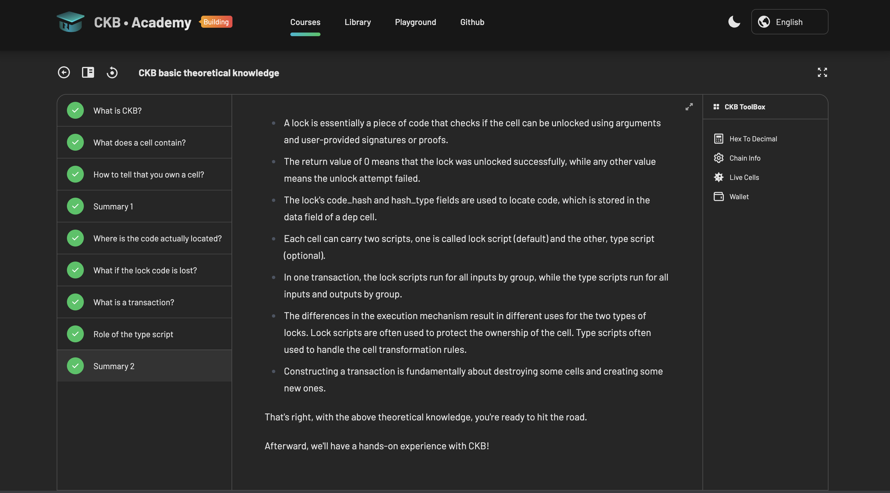

# CKBuilder Weekly Report — Weeks 1–2 (Onboarding)

**Name:** Karas
**Week Ending::** 21 August 2026
**Repo:** https://github.com/karasbuilder/ckbuilder
**Focus:** Environment, CKB fundamentals, and one contract taken from scaffold to a public chain

## Courses completed

- **[CKBuilder Handbook](https://docs.google.com/document/d/1aFHXU1ZL1MyIbBAIVRjG6stqdWwPUPyHV90O1QNwY-M/edit)** — read in full, mapped the Beginner → Intermediate → Advanced path and built a working index of every linked resource.
- **[Introduction to Nervos CKB](https://docs.nervos.org/docs/ckb-fundamentals/nervos-blockchain)** — the fundamentals behind the cell model and CKByte economics.
- **[CKB Academy — basic theoretical knowledge](https://academy.ckb.dev/courses/basic-theory)** — all 9 lessons.
- **[Quick Start](https://docs.nervos.org/docs/getting-started/quick-start)** — completed; environment set up and verified.
- **[OffCKB tool reference](https://docs.nervos.org/docs/sdk-and-devtool/offckb)** — read alongside the Quick Start, which only covers node startup and stops short of build and deploy.
- **[Detailed JS scripting](https://docs.nervos.org/docs/script/js/js-quick-start)** — the working reference for the ckb-js-vm contract.
- **[Rust book](https://doc.rust-lang.org/stable/book/title-page.html) sections 1–3** — skimmed: variables and mutability, data types, functions. Cairo experience makes the ownership model feel familiar, which should shorten the ramp to Rust contract work.

## Key learnings

**Script code lives in a cell, not in an account.** Deploying a contract means writing its
bytecode into a cell's `data` field. Nothing "installs" it. 

**`code_hash` + `hash_type` is a content address.** With `hash_type: data2` the `code_hash`
is the CKB-flavoured blake2b-256 of the bytecode itself.

**Cell model vs account model.** A balance is not a number stored anywhere — it is the sum
of capacity across every live cell your lock script can unlock. Cells are consumed and
recreated, never updated. On Ethereum data written stays forever; on CKB it occupies
capacity you have locked and can reclaim.

**Transaction structure.** Six arrays, with the signature living in `witnesses` rather than
alongside the inputs; fees are the difference between input and output capacity; cell deps
are *read* rather than consumed, which is what lets many transactions share one code cell.

**NC-MAX consensus.** Eaglesong PoW, selfish-mining resistance, orphan and uncle blocks,
dynamic block intervals.

**The devnet RPC proxy on `:28114` is not the node.** The node serves `:8114`; OffCKB puts a
proxy in front on `:28114` and that is what tooling should target. This cost me real time —
see Blockers.

**A devnet has persistent state.** Restarting `offckb node` resumed the same chain: my
11 August deploy at block 20 was still live when I came back to it days later, by then at
tip 233. `offckb clean` is what actually resets it. Worth knowing before debugging a cell
that appears to have gone missing.
## Practical Progress
- Set up a local CKB dev node successfully
- Deploy a test contract to local dev node
- Queried Live Cells from CKB testnet