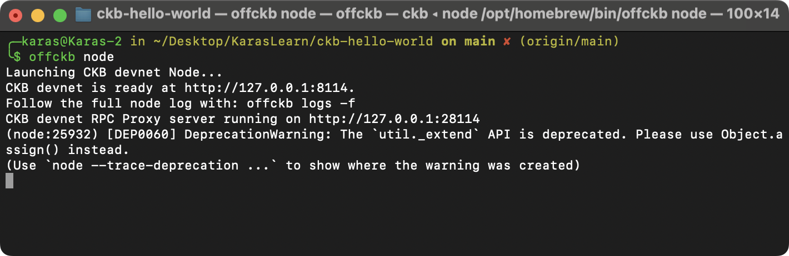
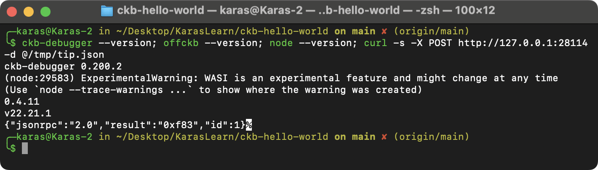
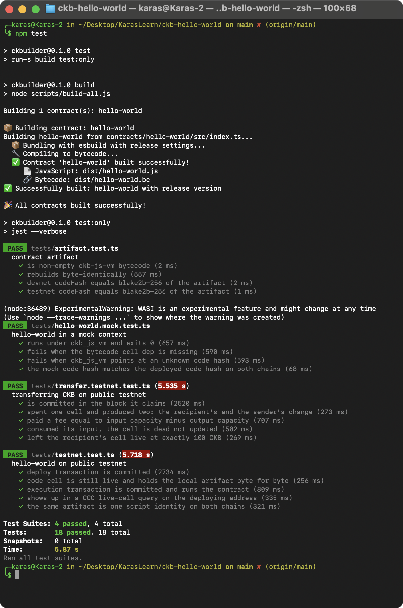
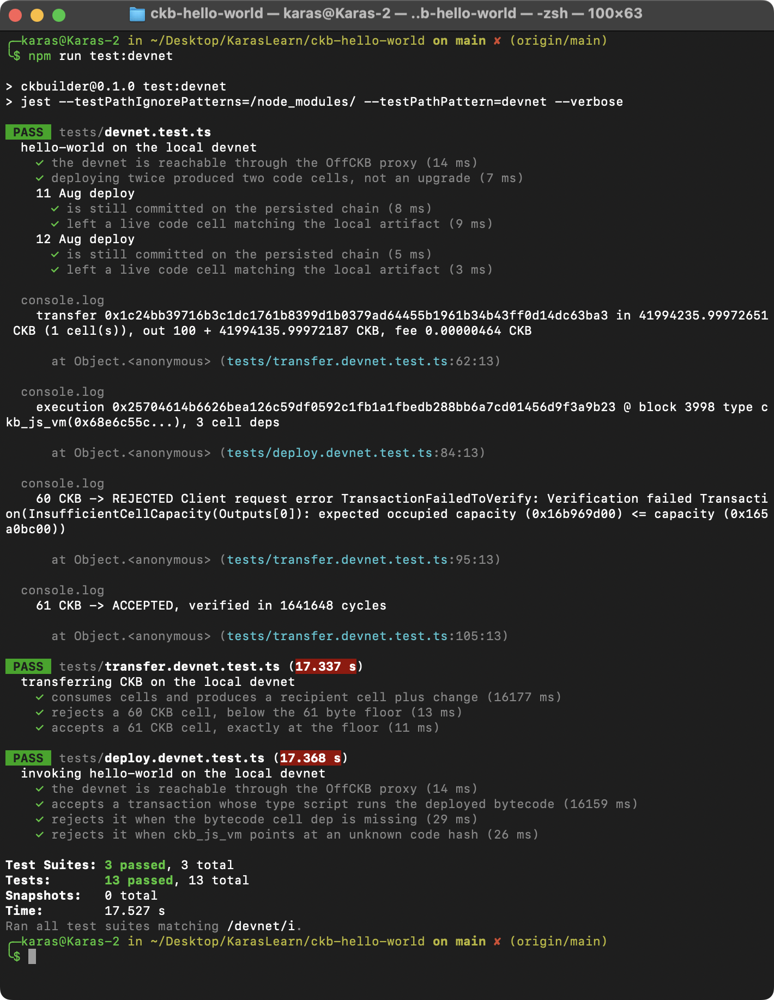
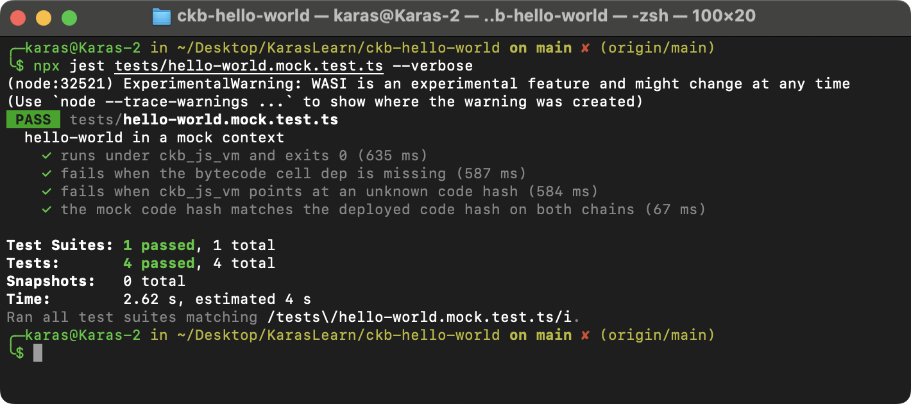
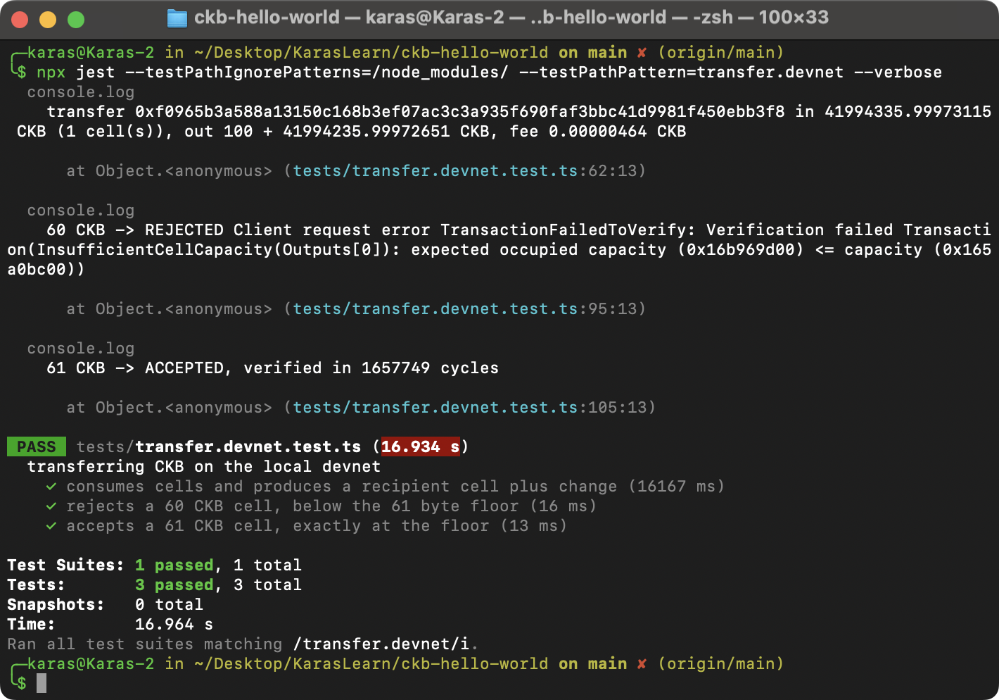
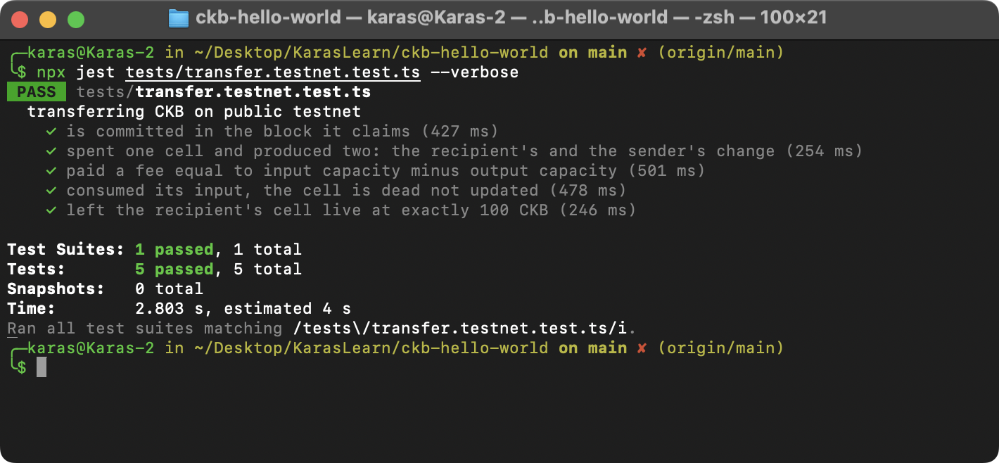

# CKBuilder Weekly Report, Week 2

**Name:** Karas

**Week Ending:** 28 August 2026

**Repo:** https://github.com/karasbuilder/ckbuilder

**Focus:** Tests that prove the contract actually runs, transfer CKB tutorial

## Summary

Last week I deployed the contract and wrote tests that check the bytecode on chain matches the bytecode on disk. None of those tests actually ran the contract though, and none of them could fail for a good reason.

So this week I mostly wrote tests that fail on purpose.

## Courses completed

- [Transfer CKB](https://docs.nervos.org/docs/dapp/transfer-ckb), first of the five basic exercises. Did it on devnet and then again on public testnet.
- [Cell](https://docs.nervos.org/docs/tech-explanation/cell) and [Capacity](https://docs.nervos.org/docs/tech-explanation/capacity)
- [ckb-js-vm docs](https://docs.nervos.org/docs/script/js/js-quick-start), re-read for the args layout


## Key learnings

**My negative test passed, which was the bug.** I wrote the two failure cases as `expect(verifySuccess()).rejects` and they both failed. Turns out `Verifier.verifySuccess()` in ckb-testtool only looks at the exit status of the ckb-debugger process, not at what the script returned. The debugger was printing `Run result: 1` the whole time, so the script really was rejecting. The helper just wasn't reporting it. Now I check `scriptErrorCode` directly.

The 61 CKB minimum turned out to be a consensus rule, not a convention. Instead of trusting the math I sent one cell at 60 CKB and one at 61:

```
60 CKB -> REJECTED  InsufficientCellCapacity(Outputs[0]):
                    expected occupied capacity (0x16b969d00) <= capacity (0x165a0bc00)
61 CKB -> ACCEPTED
```

`0x16b969d00` is 6,100,000,000 shannons, which is exactly 61 CKB. Matches 8 bytes of capacity plus 32 for the lock code hash, 20 for args, 1 for hash type. A cell's capacity is its balance and its byte budget at the same time, so every byte of data you store raises the floor by one CKB.

**Type scripts run on outputs.** Both of my on chain failures came back as `source: Outputs[0].Type` with error code 1. Not `Inputs[0]`. Lock scripts only run on inputs, so an output's lock doesn't execute until someone tries to spend that cell later. Which is why you can't restrict who receives a cell using a lock script, and why token standards are type scripts.

A transfer doesn't update a balance. On testnet:

```
0xcd39b8fec8474e6f518cf316307b37c5cdd1d59e7badd2194e1fdb6be61de580  block 22,229,375
  in  298,472.99997573 CKB (1 cell)
  out 100 CKB to recipient + 298,372.99997109 CKB change
  fee 0.00000464 CKB
```

`completeInputsByCapacity` grabs live cells until they cover the output. They basically never add up to the exact amount, so the leftover comes back as a change cell locked to me. Sending 100 CKB ate one cell and made two. The fee isn't a field anywhere, it's just whatever the inputs exceed the outputs by.

I ran the same thing on devnet first (`0x1c24bb39716b3c1dc1761b8399d1b0379ad64455b1961b34b43ff0d14dc63ba3`) and the fee came out at 464 shannons on both chains, since the transaction is the same size either way. I kept the testnet one because devnet is my laptop and nobody else can check a hash from it.

One small thing that cost me time: `ccc.fixedPointFrom(100n)` returns `100n`, while `ccc.fixedPointFrom(100)` returns `10_000_000_000n`. A bigint is already treated as shannons. My first transfer tried to make a 100 shannon cell and got rejected by the capacity rule.

## Practical Progress

```bash
offckb node        # terminal 1
npm test
npm run test:devnet
```

Four new test files:

| File | Tests | What it checks |
| --- | --- | --- |
| `tests/hello-world.mock.test.ts` | 4 | Runs in a ckb-debugger mock context, exits 0 and prints its own log line. Fails with code 1 when the cell dep is missing or the code hash is wrong. |
| `tests/deploy.devnet.test.ts` | 4 | Sends a new transaction invoking the deployed script, node commits it. Node rejects the same transaction with the cell dep dropped, and with a bad code hash. |
| `tests/transfer.devnet.test.ts` | 3 | A real transfer makes recipient + change, kills its inputs, pays fee = inputs minus outputs. 60 CKB rejected, 61 CKB accepted. |
| `tests/transfer.testnet.test.ts` | 5 | The testnet transfer checked after the fact: right block, one input two outputs, correct fee, input dead, recipient cell live. |

Counts, compared to week 1 which had 15 tests in 3 files:

```
npm test            4 suites, 18 tests passed   (was 2 suites, 9 tests)
npm run test:devnet 3 suites, 13 tests passed   (was 1 suite,  6 tests)
```

Transactions from this week:

| Chain | What | Hash |
| --- | --- | --- |
| testnet | Transfer, 100 CKB + change | `0xcd39b8fec8474e6f518cf316307b37c5cdd1d59e7badd2194e1fdb6be61de580` @ block 22,229,375 |
| devnet | Script execution via ckb_js_vm | `0x25704614b6626bea126c59df0592c1fb1a1fbedb288bb6a7cd01456d9f3a9b23` @ block 3998 |
| devnet | Transfer, 100 CKB + change | `0x1c24bb39716b3c1dc1761b8399d1b0379ad64455b1961b34b43ff0d14dc63ba3` |

Only the testnet one is worth checking, the devnet hashes come from a chain on my machine. The devnet suites also make new transactions every run, so those two are just a record of one run.

## Challenges

**hello-world has nothing to reject.** It returns 0 no matter what, so there's no way to test its own validation logic. It doesn't have any. Every negative case here is about whether the script gets reached at all. Writing a script that can actually fail is week 4, Simple Lock.

**The suite only passed the first time.** Running the transfer tests twice in a row failed the second time. It built the exact same transaction again and the node rejected it as a duplicate. Nothing to do with capacity, my test just wasn't idempotent. The two floor checks now use `sendTransactionDry`, which still runs the node's verification but leaves nothing in the mempool. Ran it three times in a row after that.

Also worth noting that `devnet.test.ts` pins the week 1 deploys at fixed block numbers, so `offckb clean` would break it.

## Environment

- macOS darwin arm64
- OffCKB 0.4.11, Node v22.21.1 via nvm
- ckb-debugger 0.200.2, new this week because ckb-testtool's `Verifier` needs it
- ckb-testtool 1.0.5, @ckb-ccc/core 1.12.2, jest 29 + ts-jest

## Next week

Cell model in more depth, RFC 0022 on transaction structure, and Store Data on Cell. I want to read the stored data back over raw RPC instead of trusting the tutorial output.

## Evidence

`offckb node` in the first terminal, which everything below needs:



Tool versions, and the devnet tip through the proxy on 28114:



`npm test`, the build plus the three suites that don't need a node:



`npm run test:devnet`:



The mock context on its own, with both failure cases:



The devnet transfer suite, with the change cell and the node's own reply for 60 and 61 CKB:



The testnet transfer, checked against the live chain. This is the one anyone can verify on [the explorer](https://testnet.explorer.nervos.org/transaction/0xcd39b8fec8474e6f518cf316307b37c5cdd1d59e7badd2194e1fdb6be61de580):


