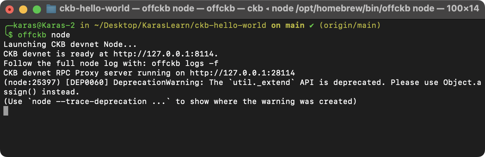
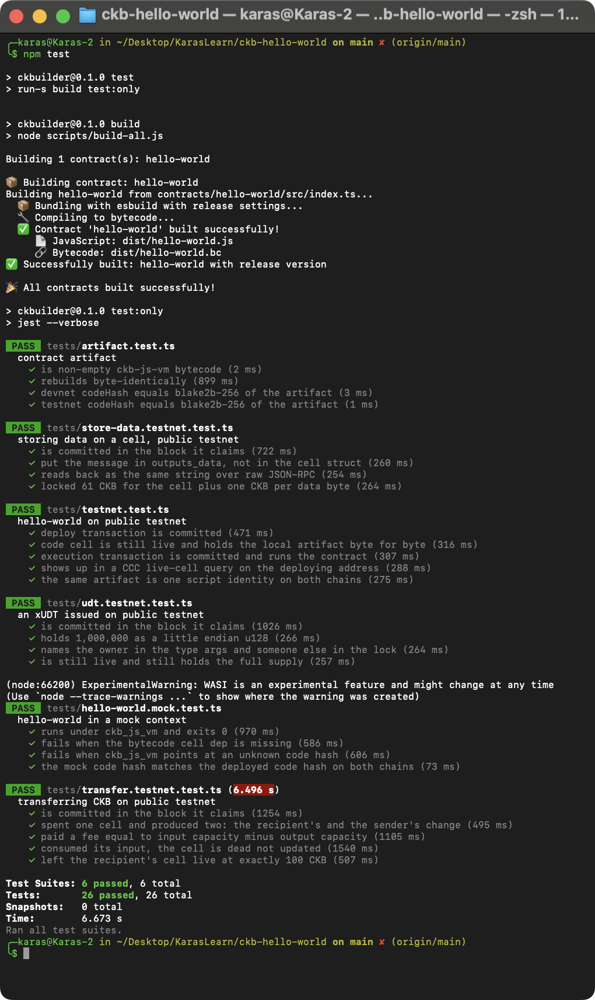
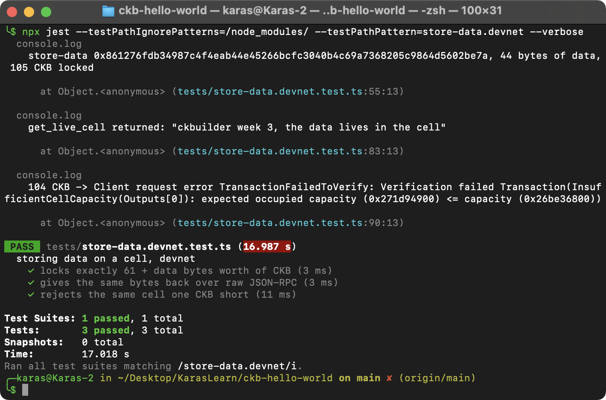
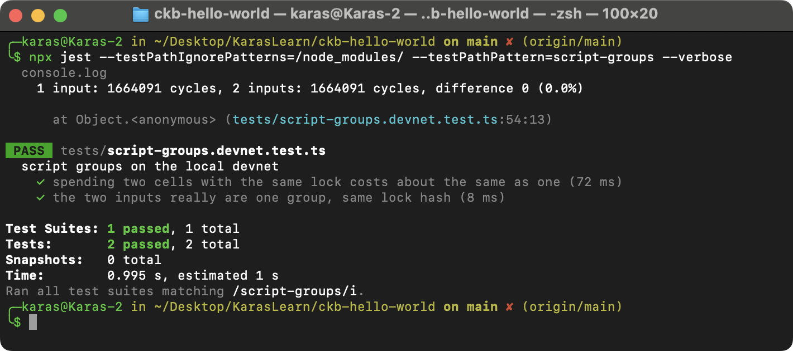
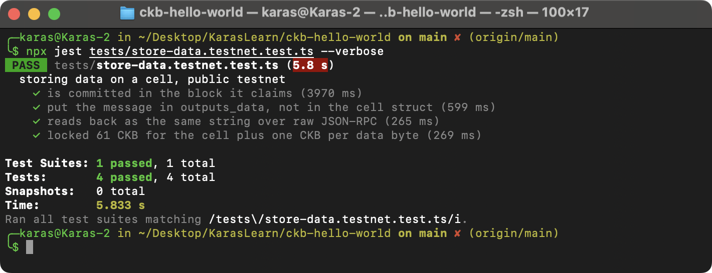
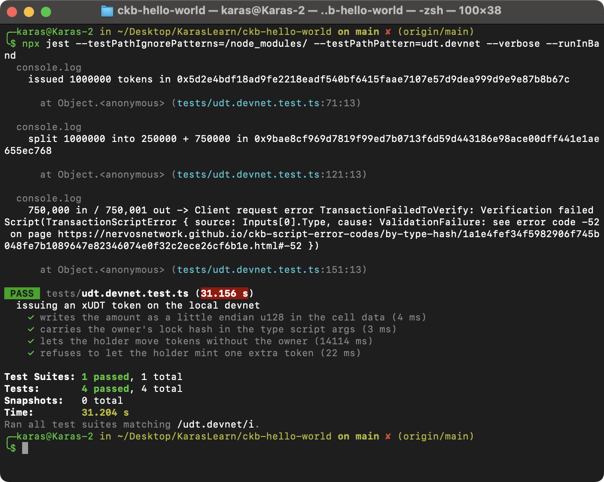
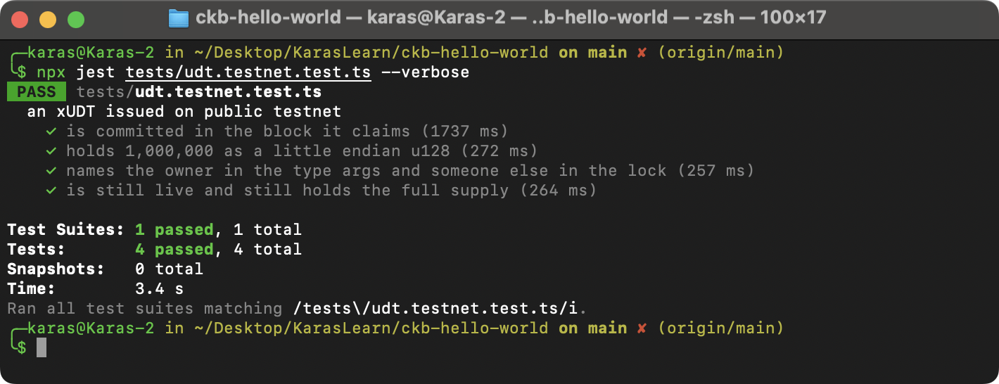
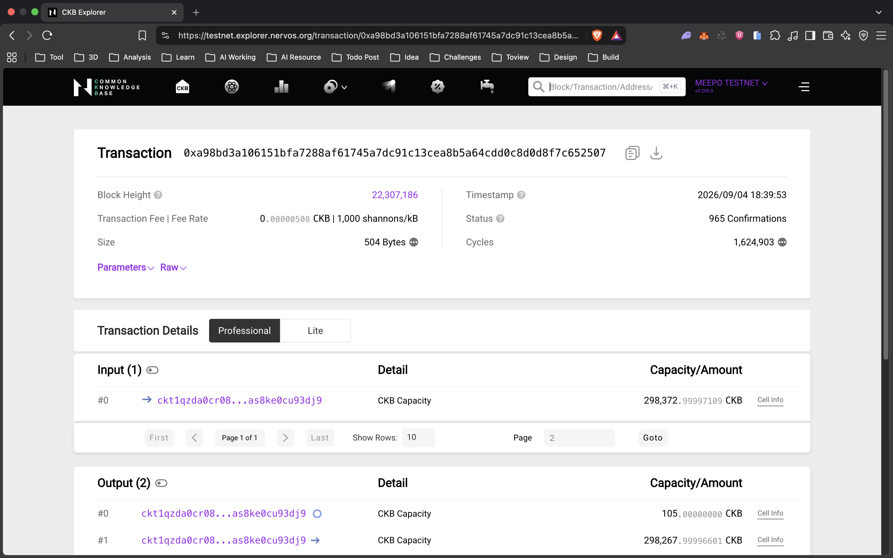
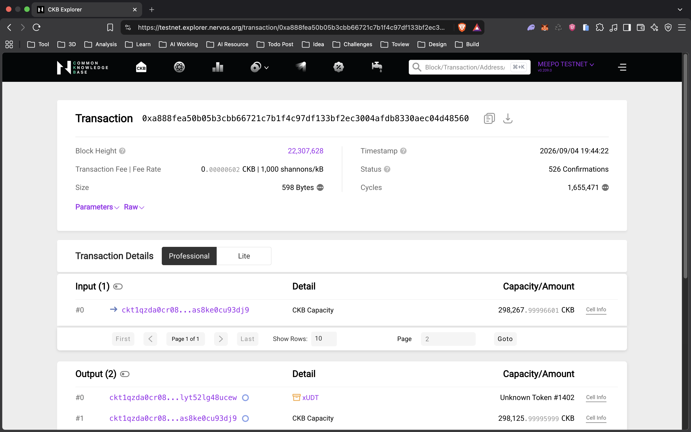
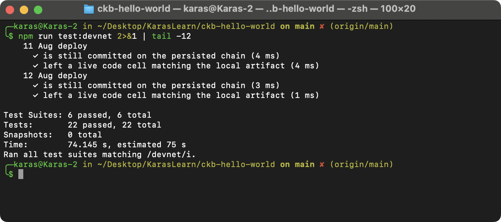

# CKBuilder Weekly Report, Week 3

**Name:** Karas

**Week Ending:** 4 September 2026

**Repo:** https://github.com/karasbuilder/ckbuilder

**Focus:** Store Data on Cell, fungible tokens with xUDT, and what a transaction looks like underneath

## Summary

Week 2 was about what a transaction does. This week was about what it is made of. Two things I had read about but never checked turned out to be measurable, so I measured them instead of taking the docs' word for it.

Storing data on a cell gave me a number I can defend: 44 bytes of text costs exactly 105 CKB of locked capacity, and the node rejects 104.

I also got to the Fungible Token exercise earlier than planned, because it was the thing I said I'd do next when I sent the week 2 report. Issuing an xUDT and then failing to mint one extra token was the most useful half hour of the week.

## Courses completed

- [Store Data on Cell](https://docs.nervos.org/docs/dapp/store-data-on-cell), second of the five basic exercises. Devnet first, then public testnet.
- [Create Fungible Token](https://docs.nervos.org/docs/dapp/create-token), third of the five. Issued an xUDT on both chains.
- [RFC 0052, xUDT](https://github.com/nervosnetwork/rfcs/blob/master/rfcs/0052-extensible-udt/0052-extensible-udt.md), the owner mode rule and the u128 amount layout.
- [Cell](https://docs.nervos.org/docs/tech-explanation/cell) and [Capacity](https://docs.nervos.org/docs/tech-explanation/capacity), re-read for the occupied capacity rule now that there's data in the picture.

Both findings below came out of experiments rather than from reading the spec, which is a habit I want to keep.

## Key learnings

**Script groups are real and I could measure them.** CKB is supposed to group inputs that share an identical script and run that script once per group instead of once per cell. `sendTransactionDry` returns a cycle count, so I built one transaction spending a single cell and another spending two cells with the same lock, and compared:

```
1 input:  1,664,091 cycles
2 inputs: 1,664,091 cycles
difference 0 (0.0%)
```

Not approximately equal. Identical. The secp256k1 lock ran once and checked one signature for both cells. If it ran per cell that number would have roughly doubled.

The consequence I hadn't thought about: a script that only inspects the first cell of its group is broken. Someone can add a second cell to the same group and walk it past a check that only ever looked at index 0. Anything I write later has to iterate the whole group.

**`outputs_data` really is a separate array, and the SDK admits it.** I stored 44 bytes and then asked CCC for the cell's occupied size expecting 105. It returned 61.

That is not a bug. `occupiedSize` measures the CellOutput struct, which is capacity plus lock plus type, and stays 61 no matter how much data you attach. The data lives in a parallel `outputs_data` array indexed alongside `outputs`. You have to add its length yourself:

```
capacity     8 bytes
code_hash   32
hash_type    1
args        20
             = 61   <- what occupiedSize reports
data        44
             = 105  <- what the cell actually has to hold
```

The chain agrees. 105 CKB went through, 104 came back with:

```
InsufficientCellCapacity(Outputs[0]):
expected occupied capacity (0x271d94900) <= capacity (0x26be36800)
```

`0x271d94900` is 10,500,000,000 shannons, exactly 105 CKB.

**A token's owner and a token's holder are different people, and the type script args say so.** The Fungible Token exercise was the first time a script's `args` field did real work for me. An xUDT type script carries the owner's lock hash in `args`, and the tokens sit in a cell locked by whoever holds them. Two separate ideas in one cell.

The rule that falls out of it, from RFC 0052: if the owner's lock appears in the inputs, the transaction is in owner mode and can create supply from nothing. Otherwise the script only lets existing tokens move around. I issued 1,000,000 in owner mode, then had the holder split them 250,000 / 750,000 without the owner involved, and that went through because the totals matched.

Then I tried to put 750,001 out against 750,000 in, still without the owner:

```
Inputs[0].Type, cause: ValidationFailure: see error code -52
```

Rejected, and rejected by xUDT itself, code -52, not by some generic transaction check. Worth noting it surfaced on `Inputs[0].Type` rather than Outputs. The type script sits in both groups and the input side runs first, so that's where it stopped. In week 2 the same kind of failure showed up on `Outputs[0]` because there was no input carrying that type at all.

The amount itself is 16 bytes of little endian u128 at the front of the cell data, which is why a token cell needs 142 CKB rather than 61: 8 for capacity, 53 for the lock, 65 for the type script, and 16 for the number.

**Storage has a price you can calculate before you pay it.** One CKB per byte, on top of the 61 CKB floor, locked for as long as the cell is live and returned when it's consumed. So it's a deposit, not a fee. Very different from paying gas to write something permanent and never seeing that money again.

**Reading it back over raw RPC was worth the extra step.** The tutorial shows the message in its own UI, which proves nothing about the chain. Calling `get_live_cell` directly and decoding the hex myself is what actually closed the loop:

```
get_live_cell returned: "ckbuilder week 3, the data lives in the cell"
```

## Practical Progress

```bash
offckb node        # terminal 1
npm test
npm run test:devnet
```

Five new test files:

| File | Tests | What it checks |
| --- | --- | --- |
| `tests/store-data.devnet.test.ts` | 3 | Writes 44 bytes into a cell, locks exactly 61 + 44 CKB, reads the bytes back through raw `get_live_cell` and decodes them, and gets rejected at one CKB short. |
| `tests/script-groups.devnet.test.ts` | 2 | Dry runs one input and then two inputs sharing a lock, compares cycles, and confirms the two cells are separate outpoints with the same lock hash. |
| `tests/store-data.testnet.test.ts` | 4 | The testnet write checked after the fact: right block, data in `outputs_data`, struct still 61 bytes, string round trips over raw RPC. |
| `tests/udt.devnet.test.ts` | 4 | Issues 1,000,000 xUDT in owner mode, checks the u128 encoding and the owner lock hash in the type args, lets the holder split the tokens without the owner, and gets code -52 when the holder tries to mint one extra. |
| `tests/udt.testnet.test.ts` | 4 | The same issuance on public testnet, checked after the fact: right block, full supply, owner in the type args and a different lock on the cell. |

Counts, against week 2:

```
npm test            6 suites, 26 tests passed   (was 4 suites, 18 tests)
npm run test:devnet 6 suites, 22 tests passed   (was 3 suites, 13 tests)
```

Transactions from this week:

| Chain | What | Hash |
| --- | --- | --- |
| testnet | 44 bytes stored, 105 CKB locked | `0xa98bd3a106151bfa7288af61745a7dc91c13cea8b5a64cdd0c8d0d8f7c652507` @ block 22,307,186 |
| devnet | Same write | `0x861276fdb34987c4f4eab44e45266bcfc3040b4c69a7368205c9864d5602be7a` |
| testnet | 1,000,000 xUDT issued | `0xa888fea50b05b3cbb66721c7b1f4c97df133bf2ec3004afdb8330aec04d48560` @ block 22,307,628 |
| devnet | Same issuance | `0x5d2e4bdf18ad9fe2218eadf540bf6415faae7107e57d9dea999d9e9e87b8b67c` |
| devnet | Holder splits 1,000,000 into 250,000 + 750,000 | `0x9bae8cf969d7819f99ed7b0713f6d59d443186e98ace00dff441e1ae655ec768` |

The store data write is the same message and the same 105 CKB on both chains, which is what you'd expect when the price is just a byte count. Only the two testnet hashes are worth anyone else checking.

## Challenges

**Two suites quietly fighting over the same account.** `store-data.devnet` and `transfer.devnet` both spend from `PRIVATE_KEY`, and jest runs suites in parallel by default, so they picked the same live cell and one transaction lost. What made it annoying is how it failed: jest reported "Test suite failed to run: Do not know how to serialize a BigInt" rather than anything about the chain, because the error object it was trying to hand back between workers had cycle counts in it. Added `--runInBand` to `test:devnet`. Suites that share on-chain state can't run concurrently.

**Expecting 105 and getting 61.** Covered above. I assumed occupied size meant everything the cell costs, and spent a while checking my byte arithmetic before realising the number was correct and my mental model of the cell struct was wrong.

## Environment

- macOS darwin arm64
- OffCKB 0.4.11, Node v22.21.1 via nvm
- ckb-debugger 0.200.2, ckb-testtool 1.0.5, @ckb-ccc/core 1.12.2, jest 29 + ts-jest

## Next week

Scripts properly. The validation model, and Build a Simple Lock, which will be the first script I write that can actually reject a transaction on its own terms rather than just failing to load.

## Evidence

`offckb node` in the first terminal:



`npm test`, five suites:



The store data suite. The write, the raw `get_live_cell` readback with the decoded string, and the 104 CKB rejection:



Script groups, one input against two:



The testnet write, checked against the live chain. Verifiable on [the explorer](https://testnet.explorer.nervos.org/transaction/0xa98bd3a106151bfa7288af61745a7dc91c13cea8b5a64cdd0c8d0d8f7c652507):



The xUDT suite. Issuance in owner mode, the holder splitting tokens without the owner, and code -52 when the holder tries to mint one extra:



The testnet issuance, checked against the live chain. Verifiable on [the explorer](https://testnet.explorer.nervos.org/transaction/0xa888fea50b05b3cbb66721c7b1f4c97df133bf2ec3004afdb8330aec04d48560):



The same two testnet transactions on the explorer, which is the part anyone else can check. The store data write, output #0 sitting at exactly 105.00000000 CKB:



And the token issuance, where the explorer picks the output up as an xUDT on its own:



Devnet totals. The full run is too long to fit in one window now, so this is the tail:


